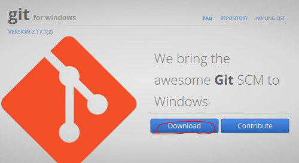

你是否想要一个属于自己的博客呢？或者正在为搭建自己的博客而无从下手呢？本篇将带你一步一步构建属于自己的博客！
>博主机器环境：Microsoft Windows [版本 10.0.17134.81]

<!--more -->
## 安装基本工具
> 1. Git Bash\[[下载地址](https://gitforwindows.org/)\]
  <!--  -->
> 
> 2. NodeJS\[[下载地址](https://nodejs.org/en/)\]，安装注意点：请在Custom Setup步骤勾选``Add to PATH``
  <!--  -->
> 

## 初步搭建博客
<!-- <video id="video" width="900" controls="controls" preload="none" poster="../archives/poster.jpg">
  <source id="mp4" src="../archives/test.mp4" type="video/mp4">
</video> -->
<!--  -->
> 1. 打开Git Bash，创建博客根目录，执行``mkdir myblog``
> 2. 进入博客根目录，执行``cd myblog``
> 3. 安装Hexo，执行``npm i -g hexo``。若已安装，无需执行
> 4. 初始化由Hexo驱动的博客，执行``hexo init``，至此一个原生的由Hexo驱动的博客就搭建好了
> 5. 下面就一睹它的芳容吧！执行``hexo server``，启动博客
> 6. 接着访问http://localhost:4000 ，效果如下：
> 
> 7. 怎么样？是不是很简陋？别着急，还没完，这只是走完了万里长征的第一步！

## 网站相关配置
### 基本信息
常规设置比如网站标题、网站作者、网站使用语言，编辑myblog/_config.yml等。更多配置说明见\[[官网配置说明](https://hexo.io/zh-cn/docs/configuration)\]，配置示例：
```yaml
title: 你的博客名称 ## 网站标题
subtitle: 子标题 ## 网站子标题(一般是座右铭)
description:
keywords:
author: 作者名称 ## 网站作者
language: zh-CN ## 网站使用语言
timezone:

# URL
## If your site is put in a subdirectory, set url as 'http://yoursite.com/child' and root as '/child/'
url: http://yoursite.com
root: /
permalink: :year:month:day.html/ ## 永久链接
permalink_defaults:
```

### 菜单配置
编辑myblog/themes/next/_config.yml，配置示例：
```yaml
menu:
  home: / || home ## 首页
  archives: /archives/ || archive ## 归档
  tags: /tags/ || tags ## 标签
  about: /about/ || user ## 关于
  #categories: /categories/ || th
  #schedule: /schedule/ || calendar
  #sitemap: /sitemap.xml || sitemap
  #commonweal: /404/ || heartbeat
```

### 社交链接
编辑myblog/themes/next/_config.yml，配置示例：
```yaml
# Social Links
# Usage: `Key: permalink || icon`
# Key is the link label showing to end users.
# Value before `||` delimeter is the target permalink.
# Value after `||` delimeter is the name of FontAwesome icon. If icon (with or without delimeter) is not specified, globe icon will be loaded.
social:
  GitHub: https://github.com/yourname || github ## 代码托管仓库地址
  E-Mail: mailto:yourname@gmail.com || envelope ## 联系邮箱地址
  #Weibo: https://weibo.com/yourname || weibo
  #Google: https://plus.google.com/yourname || google
  #Twitter: https://twitter.com/yourname || twitter
  #FB Page: https://www.facebook.com/yourname || facebook
  #VK Group: https://vk.com/yourname || vk
  #StackOverflow: https://stackoverflow.com/yourname || stack-overflow
  #YouTube: https://youtube.com/yourname || youtube
  #Instagram: https://instagram.com/yourname || instagram
  #Skype: skype:yourname?call|chat || skype
```

### 友情链接
编辑myblog/themes/next/_config.yml，配置示例：
```yaml
# Blog rolls
links_icon: link
links_title: 友情链接 ## 友情链接名称
links_layout: block
#links_layout: inline
links:
  #Title: http://example.com
  CSDN: https://www.csdn.net ## CSDN链接地址
  博客园: https://www.csblogs.com ## 博客园链接地址
  InfoQ: http://www.infoq.com/cn/ ## InfoQ链接地址
  开源中国: https://www.oschina.net/ ## 开源中国链接地址
```

### 头像设置
编辑myblog/themes/next/_config.yml，配置示例：
```yaml
# Sidebar Avatar
avatar:
  # In theme directory (source/images): /images/avatar.gif
  # In site directory (source/uploads): /uploads/avatar.gif
  # You can also use other linking images.
  url: /images/avatar.jpg ## 头像地址
  # If true, the avatar would be dispalyed in circle.
  rounded: false
  # The value of opacity should be choose from 0 to 1 to set the opacity of the avatar.
  opacity: 1
  # If true, the avatar would be rotated with the cursor.
  rotated: false
```

### 文章信息
编辑myblog/themes/next/_config.yml，配置示例：
```yaml
# Post meta display settings
post_meta:
  item_text: true
  created_at: true ## 是否显示发表时间
  updated_at:
    enable: false ## 是否显示更新时间
    another_day: true
  categories: false ## 是否显示分类
```

### 打赏设置
编辑myblog/themes/next/_config.yml，配置示例：
```yaml
# Reward (Donate)
reward_settings:
  # If true, reward would be displayed in every article by default.
  # You can show or hide reward in a specific article throuth `reward: true | false` in Front-matter.
  enable: true ## 启用打赏功能
  animation: true ## 启用鼠标悬浮二维码时字体旋转效果
  comment: 打赏说明 ## 打赏说明

reward:
  wechatpay: /images/wechatpay.jpg ## 微信二维码
  alipay: /images/alipay.jpg ## 支付宝二维码
  #bitcoin: /images/bitcoin.png 
```

### 版权声明
编辑myblog/themes/next/_config.yml，配置示例：
```yaml
footer:
  # Specify the date when the site was setup. If not defined, current year will be used.
  #since: 2015

  # Icon between year and copyright info.
  icon:
    # Icon name in fontawesome, see: https://fontawesome.com/v4.7.0/icons/
    # `heart` is recommended with animation in red (#ff0000).
    #name: user ## 禁止显示用户图标
    # If you want to animate the icon, set it to true.
    animated: false
    # Change the color of icon, using Hex Code.
    color: "#808080"

  # If not defined, `author` from Hexo main config will be used.
  copyright: 版权声明 ## 版权说明

  powered:
    # Hexo link (Powered by Hexo).
    enable: false ## 禁止显示“由Hexo强力驱动”
    # Version info of Hexo after Hexo link (vX.X.X).
    version: false ## 禁止显示Hexo版本号

  theme:
    # Theme & scheme info link (Theme - NexT.scheme).
    enable: false ## 禁止显示使用的主题
    # Version info of NexT after scheme info (vX.X.X).
    version: false ## 禁止显示使用主题的版本

  # Beian icp information for Chinese users. In China, every legal website should have a beian icp in website footer.
  # http://www.beian.miit.gov.cn
  beian:
    enable: false
    icp:
```

### 站点统计
编辑myblog/themes/next/_config.yml，配置示例：
```yaml
# Any custom text can be defined here.
custom_text: <script async src="//busuanzi.ibruce.info/busuanzi/2.3/busuanzi.pure.mini.js"></script>本站访问量 <span id="busuanzi_value_site_pv"></span> 次，访客数 <span id="busuanzi_value_site_uv"></span> 人次。 
## 引用“不蒜子”脚本进行站点统计
```

## 安装相关插件
### 搜索插件
> 1. 安装``hexo-generator-searchdb``，执行``npm install hexo-generator-searchdb --save``
> 2. 编辑myblog/themes/next/_config.yml，开启本地搜索：
```yaml
# Local search
# Dependencies: https://github.com/theme-next/hexo-generator-searchdb
local_search:
  enable: true ## 启用本地搜索
  # If auto, trigger search by changing input.
  # If manual, trigger search by pressing enter key or search button.
  trigger: auto
  # Show top n results per article, show all results by setting to -1
  top_n_per_article: 1
  # Unescape html strings to the readable one.
  unescape: false

# Swiftype Search API Key
#swiftype_key:
```

### 代码高亮（尚未完工）
编辑myblog/themes/next/_config.yml，配置示例：
```yaml
# Code Highlight theme
# Available values: normal | night | night eighties | night blue | night bright
# https://github.com/chriskempson/tomorrow-theme
highlight_theme: normalcustom light
```

## 搜索引擎优化
编辑myblog/themes/next/_config.yml，配置示例：
```yaml
# ---------------------------------------------------------------
# SEO Settings
# ---------------------------------------------------------------

# Disable Baidu transformation on mobile devices.
disable_baidu_transformation: false

# Set a canonical link tag in your hexo, you could use it for your SEO of blog.
# See: https://support.google.com/webmasters/answer/139066
# Tips: Before you open this tag, remember set up your URL in hexo _config.yml (e.g. url: http://yourdomain.com)
canonical: true

# Change headers hierarchy on site-subtitle (will be main site description) and on all post / page titles for better SEO-optimization.
seo: true ## 开启搜索引擎优化-利于本站点被搜索引擎收录

# If true, will add site-subtitle to index page, added in main hexo config.
# subtitle: Subtitle
index_with_subtitle: true ## 将子标题添加到索引页

# Automatically add external URL with BASE64 encrypt & decrypt.
exturl: false

# Google Webmaster tools verification.
# See: https://www.google.com/webmasters
#google_site_verification:

# Bing Webmaster tools verification.
# See: https://www.bing.com/webmaster
#bing_site_verification:

# Yandex Webmaster tools verification.
# See: https://webmaster.yandex.ru
#yandex_site_verification:

# Baidu Webmaster tools verification.
# See: https://ziyuan.baidu.com/site
#baidu_site_verification:

# Enable baidu push so that the blog will push the url to baidu automatically which is very helpful for SEO.
baidu_push: false
```

## 网站部署配置
编辑myblog/_config.yml，配置示例：
```yaml
# Deployment
## Docs: https://hexo.io/docs/deployment.html
deploy:
  type: git
  repo: https://github.com/anlyter/anlyter.github.io
```