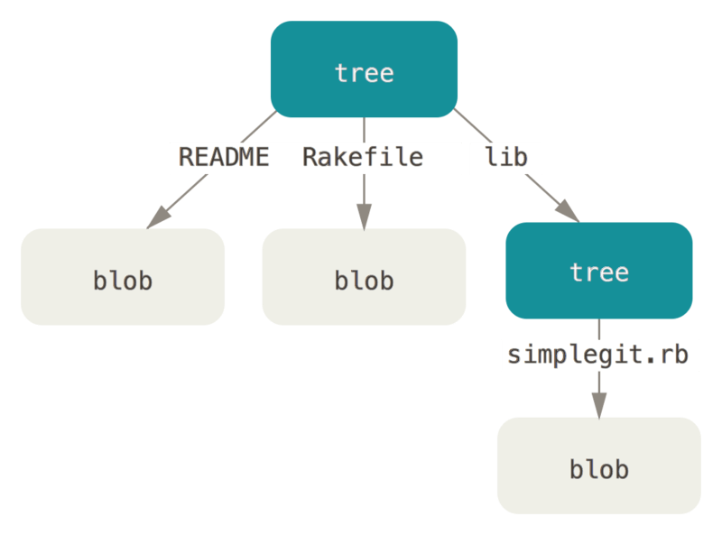

最近项目需求文档需要用到Git作为版本控制，使用过程中遇到不少问题。因此，有必要系统学习一下。

众所周知，Git是目前最流行、最先进的分布式版本控制系统。不仅好用而且还免费。

<!--more -->
### 诞生背景
在Git诞生之前，就已经有一些使用比较广泛的版本控制系统了，比如CVS、SVN等。这些版本控制系统都采用了集中式进行管理，不但速度慢，而且必须联网才能协作。大名鼎鼎的Linux之父\[[Linus](https://baike.baidu.com/item/Linus%20Torvalds/9336769)\]对此深不以为然，并坚决反对使用CVS、SVN作为Linux源码版本控制。

由于Linux代码库不断膨胀，亟需一个版本控制系统来替代手工方式进行管理。于是选择了一个商业的版本控制系统BitKeeper，但好景不长，不得已Linus单枪匹马花了两周时间用C写了一个分布式版本控制系统，Git就这样诞生了。

### 内部原理
> 前言：掌握了原理，也就抓住了一切疑难杂症的根源。因此，了解并掌握原理至关重要。

#### 对象类型
Git是基于哈希算法的一个内容寻址文件系统，其核心是一个简单的键值对数据库（key-value data store）。以存储数据对象的哈希值作为键，其本身作为值进行存储。存储数据对象有四种类型，如下：
* 数据对象（blob object）

    通常是一个普通文件（像``*.txt``、``*.word``等）或UNIX中的inodes。

* 树对象（tree object）

    UNIX中的目录项。逻辑上是一个树状结构。一个树对象包含了一条或多条树对象记录，每条记录含有一个指向数据对象或者子树对象的SHA-1指针（即存储数据对象的哈希值），以及相应的模式、类型、文件名信息。内部存储逻辑结构如下：
    

* 提交对象（commit object）

    用户提交时（即执行``git commit``）生成。它指向一个树对象，是当前项目的一个快照。记录了树对象中每条记录的哈希值、提交者、提交时间、作者，以及该提交对象的父提交对象（如果有的话）的指针。与树对象、父提交对象的关系如下：
    

* 标签对象（tag object）

    非常类似于一个提交对象————它包含创建者、创建时间、注释说明，以及一个指针。主要区别在于，标签对象通常指向一个提交对象，而不是一个树对象。但也并非必须指向某个提交对象，可以对任意类型的Git对象打标签。Git提供了两种类型的标签对象：附注标签和轻量标签。其中，轻量标签仅仅是一个固定的引用，而附注标签则复杂一些，包含更多的信息。
    
    在项目开发周期中，通常用于标识一个发版节点（如v1.0.1）。

其中数据对象、树对象、提交对象是Git的主要对象，且都存储在``.git/objects/``目录下。标签对象则存储在``.git/refs/tags``目录下。    

#### 引用类型
引用本质上是指针的一个别名，类似Java程序中的变量名（也是对象地址的形象化描述），主要方便记忆和沟通。引用类型：
* <span id="branch-ref">分支引用</span>

    Git分支的本质是一个指向某一系列提交之首的指针或引用。而分支引用则是这些指针的形象化描述（别名），存储在``.git/refs/heads/``目录下。逻辑视图如下：
    

* HEAD引用

    指向目前所在的分支。它是一个特殊的引用，并不像普通引用包含一个SHA-1值，而是指向其它引用的指针。它的内容如下：
    ```
    $ cat .git/HEAD
    ref: refs/heads/master ## master分支引用路径
    ```
    当执行``git checkout test``切换分支时，只需将``.git/HEAD``文件的内容更新为``refs/heads/test``就可以了。是不是很简单，仅仅更新``./git/HEAD``文件的指向就行了。相比SVN，切换分支就像蜗牛一样慢。因为SVN是全量拷贝模式，在带宽有限情况下，项目越大，速度就越慢。所以SVN的分支形同摆设，而Git则提倡使用分支，原因就在这！

* 标签引用

    是一个永不移动的分支引用。它指向的是标签对象的引用。存储于``.git/refs/tags/``目录下。假设为提交对象``1a410efbd13591db07496601ebc7a059dd55cfe9``创建一个附注标签：
    ```
    $ git tag -a v1.1 1a410efbd13591db07496601ebc7a059dd55cfe9 -m 'test tag'
    $ cat .git/refs/tags/v1.1 
    9585191f37f7b0fb9444f35a9bf50de191beadc2 ## 标签对象的SHA-1指针
    ```

* <span id="remote-ref">远程引用</span>

    当本地版本库分支同远程版本库分支执行同步动作（``git push``或``git fetch``）时，会创建或更新对远程分支的引用的一个本地记录（即``远程引用``）。它存储在本地版本库的``.git/refs/remotes/``目录下，并按远程主机名分组存放其远程分支的引用，具体示例如下：
    ```
    $ cat .git/refs/remotes/origin/master
    ca82a6dff817ec66f44342007202690a93763949 ## 远程origin主机的master分支的引用SHA-1值
    ```
    与[分支引用](#branch-ref)（位于``.git/refs/heads/``目录下的引用）之间的主要区别在于，远程引用是只读的。但可以根据它来创建一个本地的分支``git checkout origin/master``。

    事实上，它是本地分支与远程分支的纽带。通过它可以知悉远程分支的状态。

#### 对象打包
在存储数据对象时，Git会使用zlib函数式库对其进行压缩后再进行存储，以减少磁盘空间占用。但对于大文件的多个不同提交版本，Git依然会用一个全新的对象存储，即使进行压缩，也难以体现压缩的优势。

如果Git只完整保存其中一个，再保存另一个对象与之前版本的差异内容，岂不更好？

事实上，Git已经提供了这种功能，即``打包``。它会查找命名及大小相近的文件，并只保存文件不同版本之间的差异内容。由于大多数情况下需要快速访问文件的最新版本，因此最新版本会保存完整的文件内容，而历史版本则以差异方式保存。

不过，Git最初是以一种被称为“松散（loose）”的对象格式进行存储。当向远程服务器执行推送``git push``或手动执行``git gc``时都会进行打包。打包后的文件存储在``.git/objects/pack/``目录下。

当然，在恰当的时间Git也会自动对仓库进行打包以节省空间和提高效率。

#### 引用规格
##### 定义
简单来说，就是远程分支与[远程引用](#remote-ref)的映射关系。执行``git fetch``默认会拉取远程版本库的所有分支，是由于在执行``git remote add origin https://github.com/schacon/simplegit-progit``添加远程版本库时，会在``.git/config``文件中配置默认的映射关系：
```
[remote "origin"]
	url = https://github.com/schacon/simplegit-progit
	fetch = +refs/heads/*:refs/remotes/origin/* ## 默认引用规格，表示强制更新远程版本库refs/heads/目录下的所有引用（分支引用）到本地版本库refs/remotes/origin/目录下
```
从上面可以看出引用规格的格式是由一个可选的``+``号（表示在不能快进的情况下也要更新引用）和紧随其后的``<src>:<dst>``组成，其中``<src>``是一个模式，代表远程版本库中的引用；``<dst>``是那些远程版本库中的引用在本地库中所对应的存放位置（站在本地库的角度，这个位置存放的引用将其称之为[远程引用](#remote-ref)）。

##### 类型
> 不管哪种类型，指定引用规格有两种方式：命令行和配置文件。命令行是一次性的，而配置文件是永久性的（即``git fetch``或``git push``命令无参模式的默认行为）。
###### 拉取
假如只需拉取远程的``master``分支，可以修改``.git/config``文件为：
```
[remote "origin"]
	url = https://github.com/schacon/simplegit-progit
	fetch = +refs/heads/master:refs/remotes/origin/master
```
若想临时拉取远程的``master``分支到本地的``origin/mymaster``分支，可以通过命令行指定引用规格：
```
$ git fetch origin master:refs/remotes/origin/mymaster ## 若省略:refs/remotes/origin/mymaster，则本地引用名与远程引用master同名
```
也可以指定多个引用规格，同时拉取多个分支：
```
$ git fetch origin master:refs/remotes/origin/mymaster \ topic:refs/remotes/origin/topic
From git@github.com:schacon/simplegit
 ! [rejected]        master     -> origin/mymaster  (non fast forward)
 * [new branch]      topic      -> origin/topic
```
同样地，也可以在配置文件指定多个引用规格：
```
[remote "origin"]
	url = https://github.com/schacon/simplegit-progit
	fetch = +refs/heads/master:refs/remotes/origin/master
	fetch = +refs/heads/experiment:refs/remotes/origin/experiment
```
执行``git fetch``时，会默认拉取master和experiment分支。而不需要像命令行那样每次拉取都需指定相应分支路径。

###### 推送
当本地开发完成时，将本地分支推送至远程版本库，有两种方式：
* 命令行
```
$ git push origin master:refs/heads/master ## 将本地的master分支推送至远程版本库的master分支。当远程版本库的分支名要与本地库的分支名保持一致时，可以省略:refs/heads/master
```
* 配置文件
```
[remote "origin"]
	url = https://github.com/schacon/simplegit-progit
	fetch = +refs/heads/*:refs/remotes/origin/*
	push = refs/heads/master:refs/heads/master ## 推送引用规格，表示将本地库的master推送至远程库的master分支
```

##### 协作
如果一个项目有几个团队在远程分支上展开协作，为便于分支管理和团队协作，以不至于发生混乱，可以使用命名空间。假如有一个QA团队，推送远程分支master时，可以这样：
```
$ git push origin master:refs/heads/qa/master ## 本地master分支推送至远程库refs/heads/qa/master中，其中qa是QA团队的命名空间
```
也可以通过配置文件：
```
[remote "origin"]
	url = https://github.com/schacon/simplegit-progit
	fetch = +refs/heads/*:refs/remotes/origin/* ## 拉取引用规格
	push = refs/heads/master:refs/heads/qa/master ## 推送引用规格
```
本质上，所谓的命名空间其实就是为了将远程分支进行分类。

##### 删除
通过引用规格删除远程版本库的远程分支：
```
$ git push origin :topic
```
由于引用规格格式为``<src>:<dst>``，上述``<src>``为空，表示将远程版本库的topic分支定义为空值，也就是删除它。当然也可以使用新的语法（自Git v1.7.0以后可用）：
```
$ git push origin --delete topic
```

### 