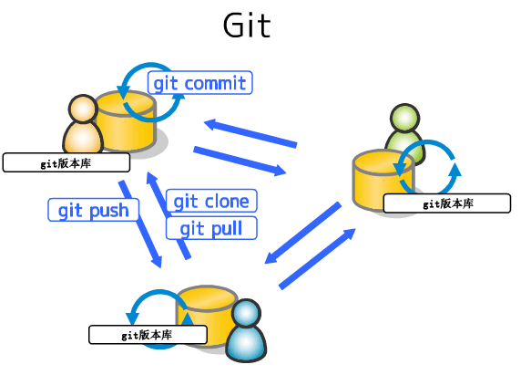
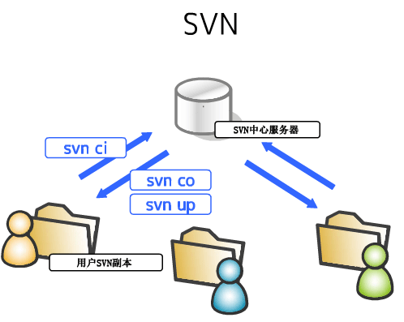

最近项目需求文档需要用到Git作为版本控制，使用过程中遇到不少问题。因此，有必要系统学习一下。

众所周知，Git是目前最流行、最先进的分布式版本控制系统。不仅好用而且还免费。

<!--more -->
### 诞生背景
在Git诞生之前，就已经有一些使用比较广泛的版本控制系统了，比如CVS、SVN等。这些版本控制系统都采用了集中式进行管理，不但速度慢，而且必须联网才能协作。

大名鼎鼎的Linux之父\[[Linus](https://baike.baidu.com/item/Linus%20Torvalds/9336769)\]对此深不以为然，并坚决反对使用CVS、SVN作为Linux源码版本控制。

由于Linux作为一个开源项目，得到了来自世界各地开发者的贡献。使得相当长一段时间内，绝大多数的Linux内核维护工作都花在了提交补丁和保存归档的繁琐事物上。直到2002年，整个项目开始启用一个专有的分布式版本控制系统BitKeeper来管理和维护代码。

但好景不长。到了2005年，开发BitKeeper的商业公司收回了人道主义援助，要开始收费。Linus迫于无奈，只好另起炉灶，开发自己的版本系统，于是Git就这样诞生了。

### 工作原理
> 前言：掌握了原理，也就抓住了一切疑难杂症的根源。因此，了解并掌握原理至关重要。

上文已提到，Git是一个分布式版本控制系统。那什么是分布式版本控制系统？先来看一张高清大图：

从上图可以看出，每个用户都有一份完整的版本库，可以自由提交，不受网络限制。在必要时，还可以互相协作。这就是分布式，每台机器互相平等，没有主次之分。相反，集中式必须有一台机器作为服务器，其它机器须通过它才能进行协作；因此，它的工作模式是这样的：


当然，实际开发中，Git通常也有一台机器充当“服务器”，便于团队协作，供团队成员交换修改。但它不是必须的。

了解了什么是分布式版本控制系统，再来看一下它的工作流程是怎样的，如图：

上图展示了远程库（Remote）、本地库（Repository）、暂存区（Index）、工作区（Workspace）之间的协作流程。下面一一介绍下：
* 远程库（Remote）

    一般是裸仓库（即没有``工作区``）。和本地库一样，区别在于它是用于团队成员间的协作。

* 本地库（Repository）

    位于``.git``目录下。它是Git用来保存项目元数据和对象数据库的地方。也就是``git commit``后数据存储的地方。

* 暂存区（Index）

    也叫索引，一般位于``.git``目录下。它是一个文件，记录了待提交的文件列表信息。

* 工作区（Workspace）

    版本库中某个版本解压出来的项目副本，供用户修改。

接下来，结合上图具体来讲一下它的基本工作流程：

1. 在工作区（即工作目录）中修改文件（文件对应状态：未跟踪或已修改）。

1. ``git add``暂存修改的文件，将文件的快照放入暂存区（文件对应状态：已暂存）。

1. ``git commit``将暂存区域的文件快照提交到本地库（文件对应状态：已提交）。

1. ``git push``将本地库的最新代码推送至远程库，通常需先``git pull``同步远程库代码至本地。

另外，基本工作流程中的不同节点，实际反映了本地库中文件的四种状态：
1. 未跟踪

    未纳入到本地库。

1. 已修改

    已纳入本地库但尚未暂存。

1. 已暂存

    已暂存但尚未提交。

1. 已提交

    已安全保存在本地数据库。

### 内部原理
#### 对象类型
Git是基于哈希算法的一个内容寻址文件系统，其核心是一个简单的键值对数据库（key-value data store）。以存储数据对象的哈希值作为键，其本身作为值进行存储。存储数据对象有四种类型，如下：
* 数据对象（blob object）

    通常是一个普通文件（像``*.txt``、``*.word``等）或UNIX中的inodes。

* <span id="tree-obj">树对象（tree object）</span>

    UNIX中的目录项。逻辑上是一个树状结构。一个树对象包含了一条或多条树对象记录，每条记录含有一个指向数据对象或者子树对象的SHA-1指针（即存储数据对象的哈希值），以及相应的模式、类型、文件名信息。内部存储逻辑结构如下：
    

* 提交对象（commit object）

    用户提交时（即执行``git commit``）生成。它指向一个树对象，是当前项目的一个快照。记录了树对象中每条记录的哈希值、提交者、提交时间、作者，以及该提交对象的父提交对象（如果有的话）的指针。与树对象、父提交对象的关系如下：
    

* 标签对象（tag object）

    非常类似于一个提交对象————它包含创建者、创建时间、注释说明，以及一个指针。主要区别在于，标签对象通常指向一个提交对象，而不是一个树对象。但也并非必须指向某个提交对象，可以对任意类型的Git对象打标签。Git提供了两种类型的标签对象：附注标签和轻量标签。其中，轻量标签仅仅是一个固定的引用，而附注标签则复杂一些，包含更多的信息。
    
    在项目开发周期中，通常用于标识一个发版节点（如v1.0.1）。

其中数据对象、树对象、提交对象是Git的主要对象，且都存储在``.git/objects/``目录下。标签对象则存储在``.git/refs/tags``目录下。    

#### 引用类型
引用本质上是指针的一个别名，类似Java程序中的变量名（也是对象地址的形象化描述），主要方便记忆和沟通。引用类型：
* <span id="branch-ref">分支引用</span>

    Git分支的本质是一个指向某一系列提交之首的指针或引用。而分支引用则是这些指针的形象化描述（别名），存储在``.git/refs/heads/``目录下。逻辑视图如下：
    

* HEAD引用

    指向目前所在的分支。它是一个特殊的引用，并不像普通引用包含一个SHA-1值，而是指向其它引用的指针。它的内容如下：
    ```
    $ cat .git/HEAD
    ref: refs/heads/master ## master分支引用路径
    ```
    当执行``git checkout test``切换分支时，只需将``.git/HEAD``文件的内容更新为``refs/heads/test``就可以了。是不是很简单，仅仅更新``./git/HEAD``文件的指向就行了。相比SVN，切换分支就像蜗牛一样慢。因为SVN是全量拷贝模式，在带宽有限情况下，项目越大，速度就越慢。所以SVN的分支形同摆设，而Git则提倡使用分支，原因就在这！

* 标签引用

    是一个永不移动的分支引用。它指向的是标签对象的引用。存储于``.git/refs/tags/``目录下。假设为提交对象``1a410efbd13591db07496601ebc7a059dd55cfe9``创建一个附注标签：
    ```
    $ git tag -a v1.1 1a410efbd13591db07496601ebc7a059dd55cfe9 -m 'test tag'
    $ cat .git/refs/tags/v1.1 
    9585191f37f7b0fb9444f35a9bf50de191beadc2 ## 标签对象的SHA-1指针
    ```

* <span id="remote-ref">远程引用</span>

    当本地版本库分支同远程版本库分支执行同步动作（``git push``或``git fetch``）时，会创建或更新对远程分支的引用的一个本地记录（即``远程引用``）。它存储在本地版本库的``.git/refs/remotes/``目录下，并按远程主机名分组存放其远程分支的引用，具体示例如下：
    ```
    $ cat .git/refs/remotes/origin/master
    ca82a6dff817ec66f44342007202690a93763949 ## 远程origin主机的master分支的引用SHA-1值
    ```
    与[分支引用](#branch-ref)（位于``.git/refs/heads/``目录下的引用）之间的主要区别在于，远程引用是只读的。但可以根据它来创建一个本地的分支``git checkout origin/master``。

    事实上，它是本地分支与远程分支的纽带。通过它可以知悉远程分支的状态。

#### 对象打包
在存储数据对象时，Git会使用zlib函数式库对其进行压缩后再进行存储，以减少磁盘空间占用。但对于大文件的多个不同提交版本，Git依然会用一个全新的对象存储，即使进行压缩，也难以体现压缩的优势。

如果Git只完整保存其中一个，再保存另一个对象与之前版本的差异内容，岂不更好？

事实上，Git已经提供了这种功能，即``打包``。它会查找命名及大小相近的文件，并只保存文件不同版本之间的差异内容。由于大多数情况下需要快速访问文件的最新版本，因此最新版本会保存完整的文件内容，而历史版本则以差异方式保存。

不过，Git最初是以一种被称为“松散（loose）”的对象格式进行存储。当向远程服务器执行推送``git push``或手动执行``git gc``时都会进行打包。打包后的文件存储在``.git/objects/pack/``目录下。

当然，在恰当的时间Git也会自动对仓库进行打包以节省空间和提高效率。

#### 引用规格
##### 定义
简单来说，就是远程分支与[远程引用](#remote-ref)的映射关系。执行``git fetch``默认会拉取远程版本库的所有分支，是由于在执行``git remote add origin https://github.com/schacon/simplegit-progit``添加远程版本库时，会在``.git/config``文件中配置默认的映射关系：
```
[remote "origin"]
	url = https://github.com/schacon/simplegit-progit
	fetch = +refs/heads/*:refs/remotes/origin/* ## 默认引用规格，表示强制更新远程版本库refs/heads/目录下的所有引用（分支引用）到本地版本库refs/remotes/origin/目录下
```
从上面可以看出引用规格的格式是由一个可选的``+``号（表示在不能快进的情况下也要更新引用）和紧随其后的``<src>:<dst>``组成，其中``<src>``是一个模式，代表远程版本库中的引用；``<dst>``是那些远程版本库中的引用在本地库中所对应的存放位置（站在本地库的角度，这个位置存放的引用将其称之为[远程引用](#remote-ref)）。

##### 类型
> 不管哪种类型，指定引用规格有两种方式：命令行和配置文件。命令行是一次性的，而配置文件是永久性的（即``git fetch``或``git push``命令无参模式的默认行为）。
###### 拉取
``git fetch``命令的无参模式会根据``.git/config``文件的引用规格进行拉取，假设``.git/config``文件的拉取引用规格配置如下：
```
[remote "origin"]
	url = https://github.com/schacon/simplegit-progit
	fetch = +refs/heads/master:refs/remotes/origin/master
```
或配置多个拉取引用规格：
```
[remote "origin"]
	url = https://github.com/schacon/simplegit-progit
	fetch = +refs/heads/master:refs/remotes/origin/master
	fetch = +refs/heads/experiment:refs/remotes/origin/experiment
```
当执行``git fetch``命令时，会拉取远程库的master和experiment分支自上次拉取之后的最新代码至本地（``objects``目录中），并在本地创建或更新（若已存在）其相应分支的远程引用``refs/remotes/origin/master``和``refs/remotes/origin/experiment``。

除此之外，也可以通过命令行指定引用规格：
```
$ git fetch origin master:refs/remotes/origin/mymaster ## 若省略:refs/remotes/origin/mymaster，则本地引用名与远程引用master同名
```
或同时指定多个引用规格：
```
$ git fetch origin master:refs/remotes/origin/mymaster \ topic:refs/remotes/origin/topic
From git@github.com:schacon/simplegit
 ! [rejected]        master     -> origin/mymaster  (non fast forward)
 * [new branch]      topic      -> origin/topic
```
不过命令行方式是临时性的，每次拉取时需指定引用规格。

###### 推送
当本地开发完成时，将本地分支推送至远程版本库，有两种方式：
* 命令行
```
$ git push origin master:refs/heads/master ## 将本地的master分支推送至远程版本库的master分支。当远程版本库的分支名要与本地库的分支名保持一致时，可以省略:refs/heads/master
```
* 配置文件
```
[remote "origin"]
	url = https://github.com/schacon/simplegit-progit
	fetch = +refs/heads/*:refs/remotes/origin/*
	push = refs/heads/master:refs/heads/master ## 推送引用规格，表示将本地库的master推送至远程库的master分支
```

##### 协作
如果一个项目有几个团队在远程分支上展开协作，为便于分支管理和团队协作，以不至于发生混乱，可以使用命名空间。假如有一个QA团队，推送远程分支master时，可以这样：
```
$ git push origin master:refs/heads/qa/master ## 本地master分支推送至远程库refs/heads/qa/master中，其中qa是QA团队的命名空间
```
也可以通过配置文件：
```
[remote "origin"]
	url = https://github.com/schacon/simplegit-progit
	fetch = +refs/heads/*:refs/remotes/origin/* ## 拉取引用规格
	push = refs/heads/master:refs/heads/qa/master ## 推送引用规格
```
本质上，所谓的命名空间其实就是为了将远程分支进行分类。

##### 删除
通过引用规格删除远程版本库的远程分支：
```
$ git push origin :topic
```
由于引用规格格式为``<src>:<dst>``，上述``<src>``为空，表示将远程版本库的topic分支定义为空值，也就是删除它。当然也可以使用新的语法（自Git v1.7.0以后可用）：
```
$ git push origin --delete topic
```

### 基本用法
#### 用户信息
由于Git是分布式版本控制系统，因此每台机器需设置用户信息，比如：姓名和邮件。配置命令：
```
$ git config --global user.name "Your Name"
$ git config --global user.email "email@example.com"
```
不过，通常在安装Git的过程中会自动配置。
#### 搭建仓库
> 主机名是远程仓库的本地简写（别名）。

* 场景一
    假如项目组来了一位新成员。由于git支持多种协议，因此远程库采用的传输协议可能有以下几种：
    ```
    $ git clone http[s]://example.com/path/to/repo.git/ ## http[s]协议
    $ git clone ssh://example.com/path/to/repo.git/ ## ssh协议
    $ git clone git://example.com/path/to/repo.git/ ## git协议
    $ git clone /opt/git/project.git ## 本地文件协议
    $ git clone file:///opt/git/project.git ## 本地文件协议
    $ git clone ftp[s]://example.com/path/to/repo.git/ ## ftp协议
    $ git clone rsync://example.com/path/to/repo.git/ ## linux下的镜像备份工具
    ```
    假设远程库采用的是https协议。现从远程库克隆仓库进行开发，执行：
    ```
    $ git clone https://example.com/path/to/repo.git/
    ```
    默认主机名是origin，可以通过``-o``参数指定主机名。示例：
    ```
    $ git clone -o reposerver https://example.com/path/to/repo.git/
    ```
    该命令会在本地主机生成一个与远程主机的版本库repo同名的目录。若要指定不同的目录名，可以执行：
    ```
    $ git clone -o reposerver https://example.com/path/to/repo.git/ myrepo
    ```
    若基于远程仓库在本地搭建一个面向内部团队的一个中央仓库（即相对于内部团队成员的一个远程仓库），可以指定``--bare``参数，注意该参数不能与``-o``参数同时指定。
* <span id="scene_second">场景二</span>
    假如项目组开始一个新的项目``myrepo``，则在``myrepo``目录下执行：
    ```
    $ git init
    ```
    该命令会初始化一个空的仓库，并且没有任何分支。只有当首次提交时，才会默认创建master分支。也可以通过指定``--bare``参数来创建一个仅用于团队成员协作的中央仓库（远程仓库）。

#### 使用仓库
> 假设通过[场景二](#scene_second)已经搭建好一个名称为``myrepo``的仓库。
##### 查看仓库状态
我们先来查看仓库状态，在仓库目录``myrepo``下执行：
```
$ git status
On branch master

No commits yet

nothing to commit (create/copy files and use "git add" to track)
```
当前仓库的状态显示目前在master分支上，并且尚未提交过任何文件、也没有任何需要提交的文件。建议创建或复制文件到工作区并使用``git add``将其纳入到暂存区。

默认无参模式输出的是详细信息，也可以使用``-s``或``--short``参数查看简要信息：
```
$ git status -s
 M README ## 右M标识
MM Rakefile ## 两个MM标识
A  lib/git.rb ## A标识
M  lib/simplegit.rb ## 左M标识
?? LICENSE.txt ## ??标识
```
从简要信息看出，文件前面有标识，分别有：``M-``（右M）、``-M``（左M）、``A``、``MM``、``??``，共五种。其中：
* 右M标识

    文件已修改但尚未暂存。

* 左M标识

    文件已修改并已暂存。

* A标识

    新添加文件并已暂存（已跟踪）。

* ??标识

    新添加文件但尚未跟踪。

* MM标识

    在``左标识``的基础上，工作区中又被修改了。

##### 添加文件
由``git status``可知，仓库没有任何提交记录。现在，我们创建一个readme.txt文件，内容如下：
```
Git is a version control system.
Git is free software.
```
查看一下仓库状态：
```
$ git status
On branch master

No commits yet

Untracked files: ## 工作目录中有未被跟踪的文件列表
  (use "git add <file>..." to include in what will be committed) ## 使用git add readme.txt将文件添加至暂存区

        readme.txt ## 未纳入版本库的文件

nothing added to commit but untracked files present (use "git add" to track)
```
接下来，将其纳入暂存区：
```
$ git add readme.txt ## 可以同时指定多个文件，比如：git add readme1.txt readme2.txt等；也可以指定通配符，即git add .表示添加当前目录下的所有文件
```
此时，readme.txt文件已被添加到暂存区。验证一下：
```
$ git status
On branch master

No commits yet

Changes to be committed: ## 暂存区中有变更的文件列表
  (use "git rm --cached <file>..." to unstage) ## 使用git rm --cached readme.txt删除已暂存的文件（该命令仅仅删除暂存区中的文件）

        new file:   readme.txt ## 新增的文件
```
提交至本地库：
```
$ git commit -m "wrote a readme file"
[master (root-commit) 89c7ac9] wrote a readme file
 1 file changed, 2 insertions(+)
 create mode 100644 readme.txt
```
其中，``-m``表示本次提交的说明。查看仓库状态：
```
$ git status
On branch master
nothing to commit, working tree clean ## 没有什么需要提交的
```
到此，已成功将``readme.txt``文件提交至本地库。有时，为了简便，使用``git commit -a -m "提交说明"``一步到位，该命令表示将所有已跟踪过并在工作目录中有修改过的文件暂存起来一并提交，从而跳过``git add``步骤。

最后，切记在提交之前一定要先暂存。特别是已暂存的文件又在工作目录中发生变更的情况。

##### 比较文件差异
> 对比分三类：工作区与暂存区、工作区与版本库、暂存区与版本库。对比本质是三个[树对象](#tree-obj)（即工作区中的树对象、暂存区中的树对象、版本库中最新指向的树对象）两两对比。

前面我们已经新增了``reademe.txt``文件，现在编辑readme.txt文件，修改为：
```
Git is a distributed version control system.
Git is free software.
```
查看仓库状态：
```
$ git status
On branch master
Changes not staged for commit: ## 工作区中有变更的文件列表
  (use "git add <file>..." to update what will be committed) ## 使用git add readme.txt将文件添加至暂存区
  (use "git checkout -- <file>..." to discard changes in working directory) ## 使用git checkout -- readme.txt撤销工作区中的修改。注意会丢失修改内容，请慎重，除非确定要这样做。

        modified:   readme.txt ## 工作区中已修改的文件

no changes added to commit (use "git add" and/or "git commit -a")
```
接下来，我们查看一下工作区与暂存区的差异：
```
$ git diff readme.txt
diff --git a/readme.txt b/readme.txt
index 46d49bf..9247db6 100644
--- a/readme.txt
+++ b/readme.txt
@@ -1,2 +1,2 @@
-Git is a version control system.
+Git is a distributed version control system.
 Git is free software.
```
工作区与版本库的差异：
```
$ git diff HEAD -- readme.txt
diff --git a/readme.txt b/readme.txt
index 46d49bf..9247db6 100644
--- a/readme.txt
+++ b/readme.txt
@@ -1,2 +1,2 @@
-Git is a version control system.
+Git is a distributed version control system.
 Git is free software.
```
由于暂存区与版本库是一致（即两个树对象内容一致）的，因此无论是工作区与暂存区、工作区与版本库的差异都是一样的。将修改的文件添加至暂存区后的仓库状态：
```
$ git status
On branch master
Changes to be committed: ## 暂存区中有待提交的文件列表
  (use "git reset HEAD <file>..." to unstage) ## 使用git reset HEAD readme.txt撤销暂存区的修改（实际上是用版本库最新指向的树对象中的readme.txt覆盖暂存区树对象中的readme.txt）

        modified:   readme.txt ## 暂存区中已修改的文件
```
再来看一下工作区与暂存区的差异：
```
$ git diff readme.txt ## 没有输出任何消息，表示没有差异
```
工作区与版本库的差异：
```
$ git diff HEAD -- readme.txt
diff --git a/readme.txt b/readme.txt
index 46d49bf..9247db6 100644
--- a/readme.txt
+++ b/readme.txt
@@ -1,2 +1,2 @@
-Git is a version control system.
+Git is a distributed version control system.
 Git is free software.
```
暂存区与版本库的差异：
```
$ git diff --cached readme.txt ## Git 1.6.1以上版本可以使用git diff --staged readme.txt，作用是一样的
diff --git a/readme.txt b/readme.txt
index 46d49bf..9247db6 100644
--- a/readme.txt
+++ b/readme.txt
@@ -1,2 +1,2 @@
-Git is a version control system.
+Git is a distributed version control system.
 Git is free software.
```
此时，工作区与版本库、暂存区与版本库的差异是一样的。最后，确认无误并无冲突后，就可以提交了：
```
$ git commit -m "add distributed"
[master 4af6259] add distributed
 1 file changed, 1 insertion(+), 1 deletion(-)
```

##### 查看提交记录
> 使用场景：当进行代码审查，或者因某些原因需要回滚代码时，需要用到。

目前已向仓库提交了两次，一次新增、一次修改。现在来查看仓库的提交记录吧！
```
$ git log
commit 4af6259c058e5e29d85bc4758c423f36974293f4 ## 提交的SHA-1校验和
Author: anlyter <anlyter@163.com> ## 提交的作者名称、邮件地址
Date:   Fri May 18 21:03:36 2018 +0800 ## 提交的时间

    add distributed ## 提交说明

commit 11c3df7fd131a218beb584755ed34d2279075e6f
Author: anlyter <anlyter@163.com>
Date:   Fri May 18 20:59:18 2018 +0800

    wrote a readme file
```
上面是``git log``无参模式时的输出格式。默认会按提交时间倒序列出所有的提交记录。

###### 常用选项

选项 | 说明
:---: | :---: | :---:
-p|按补丁格式显示每个更新之间的差异
--stat|显示每次提交的简略的统计信息，比如多少个文件变更、新增多少行、删除多少行等
--pretty=子选项|子选项有oneline（行内样式）、short、full、fuller和[format（后跟指定格式）](#git-log-pretty-format)
--abbrev-commit|表示仅显示每个提交的SHA-1的前几个字符
--graph|显示ASCII图形表示的分支合并历史
--relative-date|提交时间以较短的相对时间显示，比如“2 weeks ago”
--date|格式化提交日期或修订日期，提供的默认选项有：--date=relative、--date=local、--date=iso、--date=short等
--decorate|显示每条提交记录关联的分支或标签（如果有的话）

具体示例：
* 按行内样式显示
```
$ git log --pretty=oneline --abbrev-commit ## 行内样式，并以较短格式显示提交SHA-1
ca82a6d changed the version number
085bb3b removed unnecessary test
a11bef0 first commit
```
* 定制日期格式
```
$ git log --date="format: %Y-%m-%d %H:%M:%S" ## 需git 2.6.0以上版本才支持
commit 4af6259c058e5e29d85bc4758c423f36974293f4 (HEAD -> master)
Author: anlyter <anlyter@163.com>
Date:    2018-05-18 21:03:36

    add distributed

commit 11c3df7fd131a218beb584755ed34d2279075e6f
Author: anlyter <anlyter@163.com>
Date:    2018-05-18 21:03:36

    wrote a readme file
```

###### <span id="git-log-pretty-format">子选项-Format</span>

选项 | 说明
:---: | :---: | :---:
%H|提交对象（commit）的完整哈希字串
%h|提交对象的简短哈希字串
%T|树对象（tree）的完整哈希字串
%t|树对象的简短哈希字串
%P|父对象（parent）的完整哈希字串
%p|父对象的简短哈希字串
%an|作者（author）的名字
%ae|作者的电子邮件地址
%ad|作者修订日期（可以用 --date= 选项定制格式）
%ar|作者修订日期，按多久以前的方式显示
%cn|提交者（committer）的名字
%ce|提交者的电子邮件地址
%cd|提交日期
%cr|提交日期，按多久以前的方式显示
%s|提交说明

具体示例：
* 定制提交记录显示格式
```
$ git log --pretty=format:"%h - %an, %ar : %s"
ca82a6d - Scott Chacon, 6 years ago : changed the version number
085bb3b - Scott Chacon, 6 years ago : removed unnecessary test
a11bef0 - Scott Chacon, 6 years ago : first commit
```

###### 条件选项

选项 | 说明
:---: | :---: | :---:
-（n）|显示最近n次条提交记录，比如``-2``表示显示最近两次提交记录
--since, --after|仅显示指定时间之后的提交
--until, --before|仅显示指定时间之前的提交
--author|仅显示指定作者相关的提交
--committer|仅显示指定提交者相关的提交
--grep|仅显示含指定关键字的提交
-S|仅显示添加或移除了某个关键字的提交

具体示例：
* 按时间
```
$ git log --pretty="%h - %s" --since="2008-10-01" --before="2020-11-01" ## 表示查询2008-10-01至2020-11-01之间的提交记录
4af6259 - add distributed
11c3df7 - wrote a readme file
```
* 按作者
```
$ git log --pretty="%h - %s" --author=anlyter ## 表示查询作者是anlyter的提交记录 
4af6259 - add distributed
11c3df7 - wrote a readme file
```
* 按提交关键字
```
$ git log --pretty="%h - %s" --grep ed[或--grep=ed] -i ## 表示查询提交说明中含有ed关键字的提交记录，也支持正则表达式。-i表示不区分大小写
4af6259 - add distributed
```
* 按内容
```
$ git log --pretty="%h - %s" -S"free" -i ## 搜索首次出现“free”关键字（即第一次添加“free”关键字）或删除“free”关键字的提交记录
11c3df7 - wrote a readme file
$ git log --pretty="%h - %s" -G"^Git is.*$" -i ## 搜索内容匹配^Git is.*$正则表达式的提交记录
4af6259 - add distributed
11c3df7 - wrote a readme file
```
* 按文件
```
$ git log -- readme1.txt readme2.txt ## --表示git log命令随后的参数是文件名而非分支名
$ git log feature -- feature1.txt ## 表示查看feature分支下的feature1.txt
```
* 按分支
```
$ git log master ## 表示查看master分支的提交记录
$ git log master..feature ## 表示包含所有不在master分支中的feature分支的提交记录
```
* 按标签
```
$ git log v1.0.1 ## 表示查看v1.0.1标签之前的提交记录
$ git log v1.0.1.. ## 表示查看v1.0.1标签之后的提交记录（不包含v1.0.1）
```
* 按提交
```
$ git log 11c3d ## 表示查看11c3d之前的提交记录（包含11c3d）
$ git log 11c3d 4af62 ## 表示查看11c3d至4af62提交记录（包含11c3d和4af62）
$ git log 11c3d..4af62 ## 表示查看11c3d至4af62提交记录（但不包含11c3d）
```
* 按是否合并
```
$ git log --no-merges ## 查看非合并提交记录
$ git log --merges ## 查看合并提交记录
$ git log --merge ## 查看发生合并冲突的文件
```

###### 高亮显示
```
$ git log --graph --pretty=format:'%Cred%h%Creset -%C(yellow)%d%Cblue %s %Cgreen(%cd) %C(bold blue)<%an>'
```
* 断句

    ［%Cred%h］［%Creset -］［%C(yellow)%d ］［%Cblue%s］［%Cgreen(%cd)］［%C(bold blue)<%an>］

* 颜色

    reset（默认的灰色）、normal（正常）、black（黑色）、red（红色）、green（绿色）、yellow（黄色）、blue（蓝色）、magenta（紫红色）、cyan（蓝绿色）、white（白色）

* 字体

    bold、dim、ul、blink、reverse

###### 短日志
除了``git log``，还有一种按作者分组的短日志：
```
$ git shortlog
anlyter (2):
      add distributed
      wrote a readme file
```

##### 
> 实际开发中，有时会遇到强制删除了一个分支而后又想重新使用这个分支，或者hard-reset了一个分支从而丢弃了分支的部分commit。有什么办法把丢失的commit找回呢？

对于这种情况，git已为我们提供了``git reflog``工具。

#### 远程协作
#### 分支管理
#### 标签管理